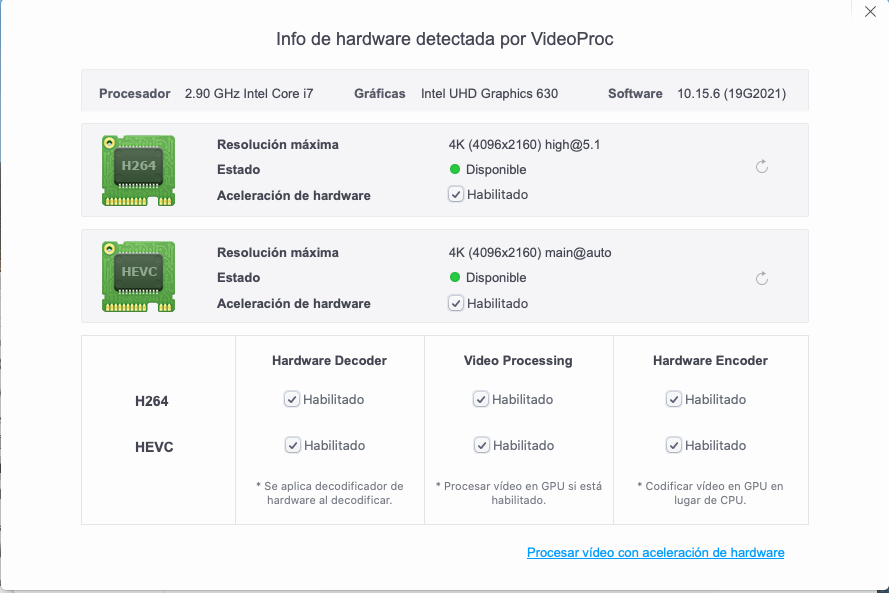

# Hackintosh-i7-10700-Gigabyte-z490-Vision-G
Hackintosh OpenCore configuration for Intel i7 10700 &amp; Z490 Vision G

**macOS**: 10.15.7 **OpenCore**: 0.6.1 **SMBIOS**: iMac20,1

## Hardware
| HARDWARE | DESCRIPTION |
|---|---|
| Motherboard  | Gigabyte Z490 VISION D ATX LGA1200 |
| CPU | Intel Core i7-10700 2.9 GHz 8-Core Processor
| Memory | G.Skill Trident Z RGB 32 GB (2 x 16 GB) DDR4-3600 CL16 |
| SSD | Western Digital SN750 500 GB M.2-2280 NVME X 2 |
| Wifi/BT | fenvi FV-T919 PCIe x1 802.11a/b/g/n/ac Wi-Fi Adapter BCM94360CD |
| Case | Gigabyte C200 Glass ATX |
| PSU | SeaSonic FOCUS 750 W 80+ Gold Certified Semi-modular |

## Working
- [x] **2.5Gb Ethernet**
- [x] **Wifi & Bluetooth**
- [x] **Audio**
- [x] **USB**
- [x] **iGPU UHD630 HDMI Output**
- [x] **Sleep/Wake**
- [x] **Shutdown**
- [x] **Restart**
- [x] **DRM**
- [x] **MacOS update**

## Not tested
- [ ] **Ethernet**
- [ ] **iGPU UHD630 DP Output** 
- [ ] **USB speed**

## BIOS
#### Disable
- Fast Boot
- CSM
- Intel SGX
- Secure Boot

#### Enable
- EHCI/XHCI Hand-off
- Above 4G decoding
- OS type : other

## Benchmarks

## Credits
https://dortania.github.io/OpenCore-Desktop-Guide

https://github.com/SchmockLord/Hackintosh-Intel-i9-10900k-Gigabyte-Z490-Vision-D

https://github.com/samuel21119/Intel-i9-10900-Gigabyte-Z490-Vision-G-Hackintosh

https://github.com/georgetree/hackintosh-10700k-Gigabyte-Z490-Vision-g

https://github.com/rursache/Hackintosh-i9-10900k-Z490-Vision-G

https://github.com/JeremySavonet/Hackintosh-i7-10700k-Z490-Vision-G